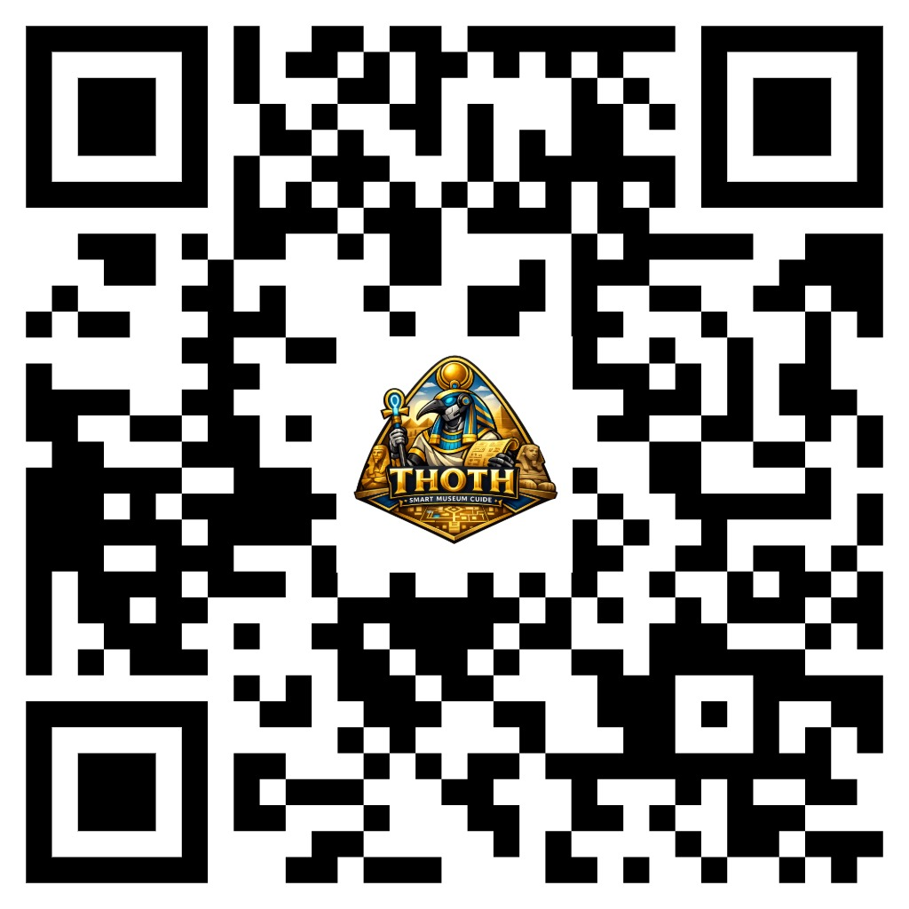
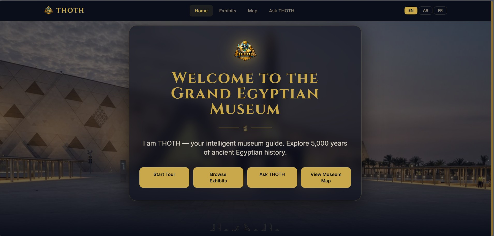
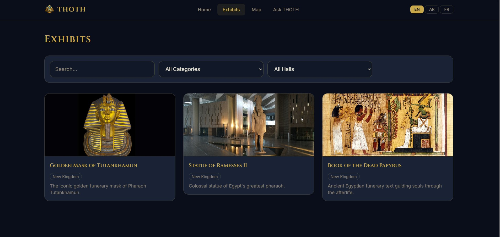

<p align="center">
  
</p>

<h1 align="center">🏛️ THOTH — Smart Museum Guide Robot</h1>

<p align="center">
  🤖 Autonomous Robot • 🧠 AI Assistant • 🗺 Interactive Museum Navigation • 🌍 Multilingual Experience
  <br/>
  🎓 <em>Graduation Project — Computer Engineering Department</em>
  <br/><br/>
  🌐 <a href="https://thoth.thoth-gem.com"><strong>Try the Live Web App</strong></a> &nbsp;·&nbsp;
  📄 <a href="docs/project1/THOTH_Grad1_Final_Presentation.pdf">View Graduation Project 1 Final Presentation</a>
</p>

---

> 🏛️ Smart Interactive Museum Guide designed for the Grand Egyptian Museum

---

# 🧠 Overview

**THOTH** is an AI-powered autonomous museum guide robot designed to enhance visitor interaction inside smart museums through intelligent assistance, interactive navigation, multilingual communication, and real-time exhibit exploration.

The system combines:

- 🤖 Robotics & Navigation
- 🧠 Artificial Intelligence & LLMs
- 🖥️ Full-Stack Touchscreen Interface
- 📷 Computer Vision & Recognition
- 🌍 Multilingual Visitor Support

THOTH aims to provide visitors with a futuristic museum experience where they can:

- browse exhibits interactively
- ask questions using voice or text
- navigate museum halls
- receive personalized multilingual explanations
- interact naturally with the robot through an intelligent touchscreen system

---

# ✨ Key Features

## 🖥️ Interactive Touchscreen Web Application

- 🏛️ Museum-themed modern UI
- 📚 Exhibit browsing & filtering
- 🌍 EN / AR / FR multilingual support
- 🗺️ Interactive museum map
- 🤖 AI chatbot interface
- ♿ Accessibility settings
- 📱 Touchscreen-optimized responsive design

---

## 🧠 AI & Voice Interaction

- 🎤 Speech-to-text support
- 🔊 Text-to-speech responses
- 🤖 LLM-powered question answering
- 🌍 Multilingual conversations
- 🧩 Exhibit-aware contextual responses
- 🎭 **Tone-adaptive replies** — vision-inferred age + mood reshape THOTH's
  voice (energetic for kids, formal for elders, calm for frustrated visitors)

---

## 📷 Computer Vision — Tone-Adaptive Responses

- 👤 Age recognition (ResNet50, 4 buckets: child / teen / adult / senior)
- 😀 Emotion recognition (EfficientNet-B0, 7-class FER2013)
- 🧠 **Live LLM tone adaptation** — the inferred age + mood are passed to
  Gemini as a hidden persona hint, so THOTH speaks differently to a child
  than to an older adult, or softens its tone when the visitor looks upset
- 🔒 **Privacy-first** — camera is OFF by default, opt-in per visitor,
  frames are never stored (only the inferred profile, with a 30s TTL)
- 🤖 Provider-agnostic — same downstream contract for the webcam path
  (live now) and the future ROS2 camera bridge

---

## 🤖 Robotics & Navigation

- 🗺️ Simulated museum navigation
- 📍 Robot localization support
- 🚧 Obstacle avoidance architecture
- 🔌 ROS2-ready integration layer
- ⚡ Future hardware deployment support

---

# 🏗️ System Architecture

```txt
       ┌────────────────────────────┐
       │   🖥 Touchscreen Web App   │
       │ React + TypeScript UI      │
       └─────────────┬──────────────┘
                     │ REST APIs
                     ▼
       ┌────────────────────────────┐
       │     ⚡ FastAPI Backend      │
       │  Business Logic & Services │
       └─────────────┬──────────────┘
                     │
      ┌──────────────┼──────────────┐
      ▼              ▼              ▼
┌──────────┐ ┌──────────┐ ┌─────────────┐ ┌──────────┐
│ 🧠 LLM   │ │ 🗄️ DB    │ │ 🤖 ROS2     │ │ 📷 Vision│
│ Gemini   │ │PostgreSQL│ │ Navigation  │ │ Age+Mood │
│ Whisper  │ │Exhibits  │ │ Simulation  │ │ PyTorch  │
└──────────┘ └──────────┘ └─────────────┘ └──────────┘
```

---

# 🔗 ROS 2 — Node & Topic Graph

Runtime communication between the sensing layer, the Nav2 navigation stack,
and the web-app docent stack. Boxes are ROS nodes / process groups; labelled
arrows are ROS topics (publisher → subscriber).

```txt
   ┌──────────────┐                              ┌──────────────┐
   │ LiDAR Driver │                              │   Camera     │
   └──────┬───────┘                              └──────┬───────┘
          │ /scan                                       │ /image_raw
          ▼                                  ┌──────────┴──────────┐
   ┌──────────────────────────┐              ▼                     ▼
   │       Nav2 Stack         │       ┌────────────┐        ┌────────────┐
   │ ┌─────────┐ ┌──────────┐ │       │  Age Node  │        │ Mood Node  │
   │ │  AMCL   │ │MapServer │ │       └──────┬─────┘        └─────┬──────┘
   │ └─────────┘ └──────────┘ │              │ /age               │ /mood
   │ ┌─────────┐ ┌──────────┐ │              ▼                    ▼
   │ │Planner +│ │   BT     │◀┐      ┌────────────────────────────────────┐
   │ │Control  │ │Navigator │ │      │           Docent Stack             │
   │ └─────────┘ └──────────┘ │      │                                    │
   └──────┬───────────────────┘ │    │      ┌──────────────────────┐      │
          │  /cmd_vel           │    │      │   Web App + LLM      │      │
          ▼                     │    │      │ FastAPI · React      │      │
   ┌──────────────┐             │    │      │ Gemini · Whisper     │──┐   │
   │ Serial Node  │             │    │      └──┬───────────────────┘  │   │
   └──────┬───────┘             │    │         ▲                      │   │
          │ serial              │    │         │                      │   │
          ▼                     │    │  ┌──────┴────────┐    ┌────────▼─┐ │
   ┌──────────────┐             │    │  │ Prompt Builder│    │   Tour   │ │
   │ Arduino +    │             │    │  │ age+mood+     │    │Coordinat.│ │
   │ Motors       │             │    │  │ exhibit       │    └──────────┘ │
   └──────────────┘             │    │  └───────▲───────┘                 │
                                │    │          │                         │
              /amcl_pose ───────┘    │  ┌───────┴──────────┐              │
              /goal_pose ────────────┼──┤  Database /      │              │
                                     │  │  Exhibit Loader  │              │
                                     │  └──────────────────┘              │
                                     └────────────────────────────────────┘
```

**Topics actually used by the FastAPI backend (`web-app/backend/app/services/ros_service.py`):**

| Direction | Name | Type | Purpose |
|---|---|---|---|
| Subscribe | `/amcl_pose` | `geometry_msgs/PoseWithCovarianceStamped` | Live robot pose → blue dot on the web map |
| Publish   | `/initialpose` | `geometry_msgs/PoseWithCovarianceStamped` | Bootstraps AMCL so it can produce the `map → odom` transform |
| Action client | `navigate_to_pose` | `nav2_msgs/action/NavigateToPose` | Sends each exhibit/tour goal in the `map` frame |
| Service client | `/lifecycle_manager_{localization,navigation}/manage_nodes` | `nav2_msgs/srv/ManageLifecycleNodes` | Best-effort STARTUP if Nav2 isn't auto-activated |

---

# 🛠️ Technologies Used

| Layer                 | Technologies                                                 |
| --------------------- | ------------------------------------------------------------ |
| **Frontend**          | React, Vite, TypeScript, Tailwind CSS                        |
| **Backend**           | FastAPI, Python, Uvicorn                                     |
| **Database**          | PostgreSQL, SQLAlchemy, Alembic                              |
| **AI / LLM**          | Google Gemini 2.5 Flash, OpenAI Whisper, ElevenLabs TTS (with edge-tts fallback) |
| **Vision**            | PyTorch (ResNet50 age, EfficientNet-B0 emotion), OpenCV Haar cascade for face crop, integrated end-to-end with the LLM |
| **Simulation / Nav**  | ROS 2 Jazzy, Gazebo Harmonic, Nav2, rclpy bridge             |
| **Deployment**        | Cloudflare Tunnel + custom domain (`thoth-gem.com`) for the live public URL, systemd / Windows-service auto-restart |
| **Future**            | Docker, AWS for cloud-hosted backend                         |

---

# 🌐 Live Deployment

The web app runs publicly at **<https://thoth.thoth-gem.com>** — scan the QR below to open it on any phone or tablet.

<p align="center">
  <a href="https://thoth.thoth-gem.com">
    
  </a>
  <br/>
  <em>Scan to launch THOTH on your device</em>
</p>

The plumbing:

- **Custom domain** `thoth-gem.com` registered through Cloudflare.
- **Cloudflare Tunnel** (`cloudflared`) — a free, persistent reverse tunnel
  pointing `thoth.thoth-gem.com` → `localhost:8001` on the demo laptop.
  No port-forwarding, no static IP, survives ISP / Wi-Fi / hotspot changes.
- **One backend port, both API and UI** — the FastAPI server mounts the
  built React bundle (`web-app/frontend/dist/`) at `/`, so a single tunnel
  exposes the whole stack.
- **Auto-restart everywhere** — backend, tunnel, and PostgreSQL all run as
  services (Windows: `.bat` infinite-loop launchers under
  `web-app/tools/windows/` + Startup folder; Linux: systemd units), so the URL
  stays alive 24/7 without anyone watching a terminal.

---

# 📂 Repository Structure

```txt
THOTH/
│
├── web-app/             # Full-stack touchscreen web application
│   ├── frontend/        #   React + TypeScript UI
│   ├── backend/         #   FastAPI REST API + ROS bridge + DB layer
│   └── tools/           #   Demo-machine launchers (Windows .bat, future Linux)
│       └── windows/
│       └── ubuntu/
│
├── image-processing/    # Vision team — age + emotion training notebooks
│                        #   (trained weights now loaded by the web-app backend)
├── simulation/          # ROS 2 + Gazebo navigation stack (sim team)
├── hardware/            # Hardware design + prototype docs
├── docs/                # Presentations, reports, architecture diagrams
├── assets/              # Logos, screenshots, demo videos
└── docker-compose.yml   # (legacy) container scaffolding for future use
```

---

# 🚀 Current Features (Grad 1)

## ✅ Implemented / In Progress

- Full-stack touchscreen web application
- Exhibit browsing system
- Multilingual architecture (EN / AR / FR)
- Interactive museum map
- AI chatbot interface
- Live webcam-driven tone adaptation (vision → LLM persona hint)
- Privacy-first opt-in camera UI on the chat page
- Backend API architecture
- PostgreSQL database structure
- Simulation-ready architecture
- AI integration preparation

---

# 🖥️ Full-Stack Web Application

The web application acts as the central interaction layer between:

- visitors
- AI systems
- exhibit database
- future ROS2 robot systems

### Main Modules

- 🏠 Home / Welcome Page
- 📚 Exhibit Browsing (search · filter by era / category)
- 🖼️ Exhibit Details (story, image, Navigate-Here, Ask THOTH)
- 🗺️ Interactive Museum Map (live robot dot + clickable markers)
- 🚶 Start Tour — preset and custom multi-stop tours with live narration
- 🎤 Ask THOTH — multilingual voice + text chat with TTS playback,
  optional webcam-driven tone adaptation

---

# 🗄️ Database Features

The database supports:

- 🌍 EN / AR / FR multilingual exhibits
- 🏛️ Exhibit metadata
- 🖼️ Multimedia assets
- 🗺️ Museum hall mapping
- 🤖 Chatbot session history
- 📍 Navigation integration

---

# 🧩 Architecture Principles

- Clean separation:
  ```txt
  models → schemas → routers → services
  ```
- Backend-controlled multilingual responses
- Modular AI integration
- ROS2-ready navigation APIs
- Scalable full-stack architecture
- Future cloud deployment support

---

# 📸 Application Preview

## 🏠 THOTH Home Page

<p align="center">
  
</p>

Modern museum-inspired touchscreen interface designed for smart interactive visitor experiences.

---

## 🖼️ Exhibit Exploration Interface

<p align="center">
  
</p>

Interactive exhibit browsing system with multilingual support and intelligent navigation-ready architecture.

---

# 🎥 Demo Videos

## 🤖 Ask THOTH — AI Museum Assistant Demo

<p align="center">
  <a href="assets/demo-videos/Web-App/Ask_THOTH_Demo.mp4">
    
  </a>
</p>

Demonstration of the THOTH AI assistant handling interactive museum-related conversations inside the touchscreen web application — multilingual voice + text chat, exhibit-aware answers, and TTS playback.

---

## 🗺️ Navigation & Tours — Web App Demo

<p align="center">
  <a href="assets/demo-videos/Web-App/Navigation_Web_Demo.mp4">
    
  </a>
</p>

End-to-end run of the web app driving the simulated robot in Gazebo through Nav2: launching preset tours, building custom multi-stop tours, single-exhibit "Navigate Here", live robot pose on the museum map, and on-arrival narration in the visitor's chosen language.

---

# 👥 Team Members

| Member | Role |
|---|---|
| **[@Mohamed Abdallah Eldairouty](https://github.com/MohamedEldairouty)** — 221001719 | 🌐 Full-Stack Web Application |
| **[@Leena Gouda](https://github.com/leena-gouda)** — 221001794 | 🧠 AI / LLM / Voice Interaction |
| **[@Nayrouz Ahmed](https://github.com/Nayrouzahmed12)** — 221011969 | 😀 Mood Recognition & Image Processing |
| **[@Youssef Waleed](https://github.com/Youssefwaleed2005)** — 221000928 | 👤 Age Recognition & Image Processing |
| **[@Habiba Ghoneim](https://github.com/HabibaGhoneim)** — 221000287 | 🗺️ Simulation & Navigation |
| **[@Saged Khaled](https://github.com/sagedkhaled263)** — 221001150 | 🗺️ Simulation & Navigation |

---

# 🎓 Supervisors

- **Dr. Marwa Elshenawy**
- **Dr. Mohamed El-Habrouk**

Department of Computer Engineering
Arab Academy for Science, Technology & Maritime Transport

---

# 🚀 Future Work

- 🤖 Physical robot deployment
- 📡 Real ROS2 navigation integration
- 🧠 Enhanced conversational AI
- 🖼️ Real exhibit recognition
- ☁️ Cloud deployment
- 📱 Mobile companion application
- 🎯 Personalized museum tours

---

# 📜 License

This project is developed for academic purposes only.
All rights reserved © THOTH Team 2026

---

<p align="center">
  🏛️ <strong>THOTH</strong> — Bringing Museums to Life Through AI & Robotics
</p>
