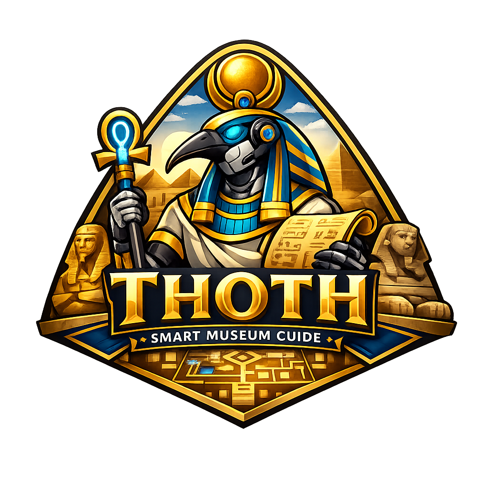

<p align="center">
  
</p>

<h1 align="center">🏛️ THOTH — Smart Museum Guide Robot</h1>

<p align="center">
  🤖 Autonomous Robot • 🧠 AI Assistant • 🗺 Interactive Museum Navigation • 🌍 Multilingual Experience
  <br/>
  🎓 <em>Graduation Project — Computer Engineering Department</em>
  <br/>
  📄 <a href="https://1drv.ms/p/c/bd8ed2cd16a50bce/IQByFXDQW8ZmRrvQCQ5zdnxmAY1gXEo0lInkzPvP77mQC7Y">View Graduation Project 1 Final Presentation</a>
</p>

---

> 🏛️ Smart Interactive Museum Guide designed for the Grand Egyptian Museum

---

# 🧠 Overview

**THOTH** is an AI-powered autonomous museum guide robot designed to enhance visitor interaction inside smart museums through intelligent assistance, interactive navigation, multilingual communication, and real-time exhibit exploration.

The system combines:

- 🤖 Robotics & Navigation
- 🧠 Artificial Intelligence & LLMs
- 🖥️ Full-Stack Touchscreen Interface
- 📷 Computer Vision & Recognition
- 🌍 Multilingual Visitor Support

THOTH aims to provide visitors with a futuristic museum experience where they can:

- browse exhibits interactively
- ask questions using voice or text
- navigate museum halls
- receive personalized multilingual explanations
- interact naturally with the robot through an intelligent touchscreen system

---

# ✨ Key Features

## 🖥️ Interactive Touchscreen Web Application

- 🏛️ Museum-themed modern UI
- 📚 Exhibit browsing & filtering
- 🌍 EN / AR / FR multilingual support
- 🗺️ Interactive museum map
- 🤖 AI chatbot interface
- ♿ Accessibility settings
- 📱 Touchscreen-optimized responsive design

---

## 🧠 AI & Voice Interaction

- 🎤 Speech-to-text support
- 🔊 Text-to-speech responses
- 🤖 LLM-powered question answering
- 🌍 Multilingual conversations
- 🧩 Exhibit-aware contextual responses

---

## 📷 Computer Vision

- 👤 Age recognition system
- 😀 Emotion / mood recognition
- 🖼️ Exhibit-aware interaction support
- 🧠 Future visitor analytics support

---

## 🤖 Robotics & Navigation

- 🗺️ Simulated museum navigation
- 📍 Robot localization support
- 🚧 Obstacle avoidance architecture
- 🔌 ROS2-ready integration layer
- ⚡ Future hardware deployment support

---

# 🏗️ System Architecture

```txt
       ┌────────────────────────────┐
       │   🖥 Touchscreen Web App   │
       │ React + TypeScript UI      │
       └─────────────┬──────────────┘
                     │ REST APIs
                     ▼
       ┌────────────────────────────┐
       │     ⚡ FastAPI Backend      │
       │  Business Logic & Services │
       └─────────────┬──────────────┘
                     │
      ┌──────────────┼──────────────┐
      ▼              ▼              ▼
┌──────────┐   ┌──────────┐   ┌─────────────┐
│ 🧠 LLM   │   │ 🗄️ DB    │   │ 🤖 ROS2     │
│ Gemini   │   │PostgreSQL│   │ Navigation  │
│ Whisper  │   │Exhibits  │   │ Simulation  │
└──────────┘   └──────────┘   └─────────────┘
```

---

# 🛠️ Technologies Used

| Layer                 | Technologies                          |
| --------------------- | ------------------------------------- |
| **Frontend**          | React, Vite, TypeScript, Tailwind CSS |
| **Backend**           | FastAPI, Python                       |
| **Database**          | PostgreSQL, SQLAlchemy, Alembic       |
| **AI / LLM**          | OpenAI, Gemini, Whisper               |
| **Vision**            | OpenCV, Deep Learning Models          |
| **Simulation**        | ROS2, Gazebo, Nav2                    |
| **Future Deployment** | Docker, AWS                           |

---

# 📂 Repository Structure

```txt
THOTH/
│
├── web-app/           # Full-stack touchscreen web application
│   ├── frontend/      #   React + TypeScript UI
│   └── backend/       #   FastAPI REST API & database layer
│
├── ai-service/        # LLM / STT / TTS integration
├── simulation/        # ROS2 & Gazebo navigation simulation
├── docs/              # Architecture diagrams & documentation
├── assets/            # Logos, screenshots, demo media
└── docker-compose.yml
```

---

# 🚀 Current Features (Grad 1)

## ✅ Implemented / In Progress

- Full-stack touchscreen web application
- Exhibit browsing system
- Multilingual architecture (EN / AR / FR)
- Interactive museum map
- AI chatbot interface
- Backend API architecture
- PostgreSQL database structure
- Simulation-ready architecture
- AI integration preparation

---

# 🖥️ Full-Stack Web Application

The web application acts as the central interaction layer between:

- visitors
- AI systems
- exhibit database
- future ROS2 robot systems

### Main Modules

- 🏠 Home / Welcome Page
- 📚 Exhibit Browsing
- 🖼️ Exhibit Details
- 🗺️ Interactive Museum Map
- 🤖 AI Chatbot
- ⚙️ Accessibility & Settings

---

# 🗄️ Database Features

The database supports:

- 🌍 EN / AR / FR multilingual exhibits
- 🏛️ Exhibit metadata
- 🖼️ Multimedia assets
- 🗺️ Museum hall mapping
- 🤖 Chatbot session history
- 📍 Navigation integration

---

# 🧩 Architecture Principles

- Clean separation:
  ```txt
  models → schemas → routers → services
  ```
- Backend-controlled multilingual responses
- Modular AI integration
- ROS2-ready navigation APIs
- Scalable full-stack architecture
- Future cloud deployment support

---

# 👥 Team Members

| Member | Role |
|---|---|
| **[@Mohamed Abdallah Eldairouty](https://github.com/MohamedEldairouty)** — 221001719 | 🌐 Full-Stack Web Application |
| **Leena Gouda** — 221001719 | 🧠 AI / LLM / Voice Interaction |
| **Nayrouz Ahmed** — 221011969 | 😀 Emotion Recognition & Image Processing |
| **[@Saged Khaled](https://github.com/sagedkhaled263)** — 221001150 | 👤 Age Recognition & Image Processing |
| **[@Youssef Waleed](https://github.com/Youssefwaleed2005)** — 221000928 | ⚡ Hardware Integration & Navigation |
| **[@Habiba Ghoneim](https://github.com/HabibaGhoneim)** — 221000287 | 🗺️ Simulation & Navigation |

---

# 🎓 Supervisors

- **Dr. Marwa Elshenawy**
- **Dr. Mohamed El-Habrouk**

Department of Computer Engineering
Arab Academy for Science, Technology & Maritime Transport

---

# 🚀 Future Work

- 🤖 Physical robot deployment
- 📡 Real ROS2 navigation integration
- 🧠 Enhanced conversational AI
- 🖼️ Real exhibit recognition
- ☁️ Cloud deployment
- 📱 Mobile companion application
- 🎯 Personalized museum tours

---

# 📜 License

This project is developed for academic purposes only.
All rights reserved © THOTH Team 2026

---

<p align="center">
  🏛️ <strong>THOTH</strong> — Bringing Museums to Life Through AI & Robotics
</p>
